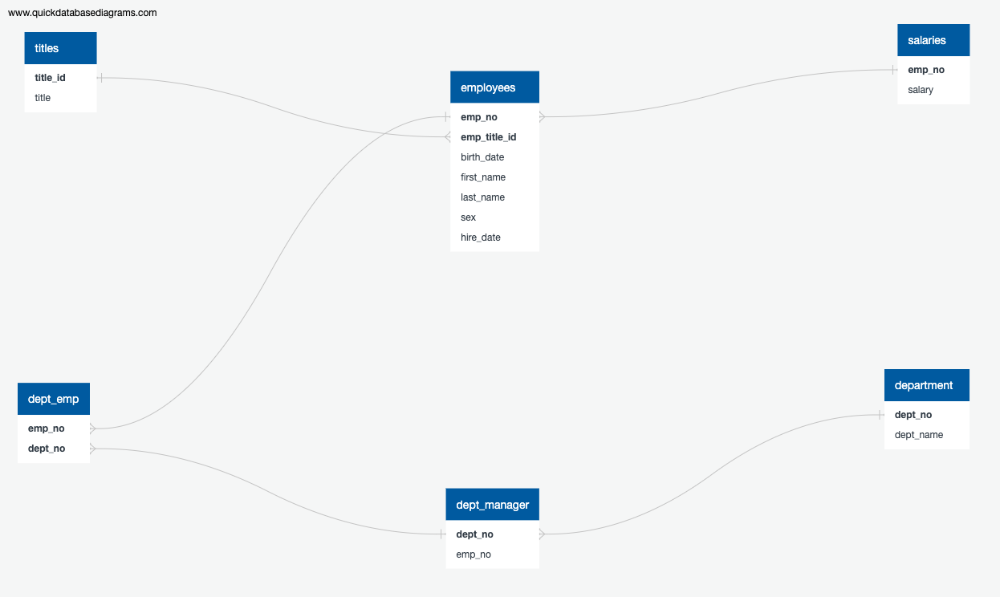

## SQL Challenge

### Background 
I was recently tasked with research project. This project will explore the contents of Pewlett Hackard, fictional company, employees from 1908 to 1990. 

### Tools 
- ERD sketch tool, such as QuickDatabaseDiagrams
- SQL database (PostgreSQL used here)
- SQL client (used pgAdmin)
- 6 CSV files on employees

### Data Engineering
Using Quick Database Diagram (QuickDBD), I was able to illustrate the connections between the six CSV files that remain from the 1980 to 1990 employee database. 

### Data Analysis 
To learn about the employees at Pewlett Hackard from 1980 to 1990, I performed the following: 

1. List the following details of each employee: employee number, last name, first name, sex, and salary.
2. List first name, last name, and hire date for employees who were hired in 1986.
3. List the manager of each department with the following information: department number, department name, the manager's employee number, last name, first name.
4. List the department of each employee with the following information: employee number, last name, first name, and department name.
5. List first name, last name, and sex for employees whose first name is "Hercules" and last names begin with "B."
6. List all employees in the Sales department, including their employee number, last name, first name, and department name.
7. List all employees in the Sales and Development departments, including their employee number, last name, first name, and department name.
8. In descending order, list the frequency count of employee last names, i.e., how many employees share each last name.

### Observations 

1. Pewlett Hackard hired 36,150 employees in 1986. 

2. Pewlett Hackard has 22 departmental managers: 
    a. 4 managers in Customer Service 
    b. 2 managers in Development   
    c. 2 managers in Finance
    d. 2 managers in Human Resources
    e. 2 managers in Marketing  
    f. 4 managers in Production
    g. 4 managers in Quality Management
    h. 2 managers in Research
    i. 2 managers in Sales 
The largest departments (Customer Service and Production) had 4 managers.

3. There were 20 employees with the first name "Hercules" and last names that begin with "B." 

4. Baba, Coorg, and Gelosh are the most frequent last names of employees hired from 1980 to 1990.

------------------------------------------------------------
### Directory Guide 
- /data - contains the six CSV files with employee data from 1980 to 1990

- /EmployeeSQL - contains conceptual schema file, data queries file and the visual shown above. This folder also contains archived files used in the earlier part of this assignment.  